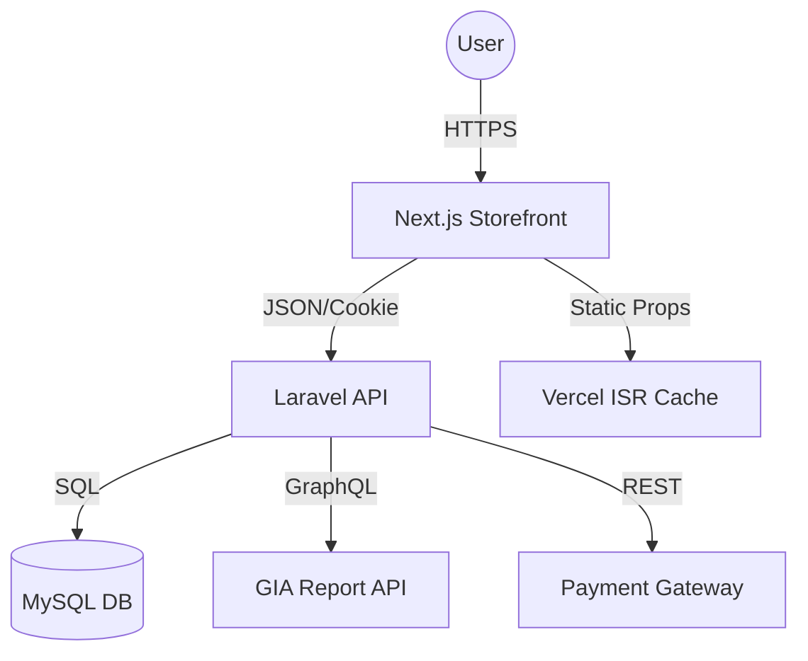

# Architecture Research

**Domain:** Luxury B2B Diamond & Jewellery Trading
**Researched:** 2026-04-09
**Confidence:** HIGH

## System Overview

The platform uses a **Headless/Decoupled Architecture** to ensure the frontend can deliver luxury-grade performance while the backend handles complex B2B logic.

### Component Boundaries

1.  **Backend (Laravel 12 API)**:
    - **Identity Provider**: RBAC management (Super Admin, Admin, Merchant).
    - **PIM (Product Information Management)**: Managing the complex schema of Diamonds (specs) and Jewellery (variants).
    - **Order Engine**: Handling RFQs, inquiries, and transaction states (Hold, Reserved).
    - **Auth Manager**: Laravel Sanctum for secure, session-based API auth.

2.  **Frontend (Next.js 16)**:
    - **Storefront**: High-performance "Formula" pages (Diamond Search, Ring Builder).
    - **Admin Dashboard**: A "Shopify-like" specialized CMS for dynamic section management.
    - **Asset Handler**: Optimization of high-res media and video backgrounds.

3.  **External Integrations**:
    - **Laboratory API (GIA/IGI)**: Real-time certificate verification.
    - **Payment Gateway**: India (Razorpay) + International (Stripe/Adyen).

### Data Flow

### Build Order & Dependencies

1.  **Foundation**: Database schema for RBAC and Diamond specs (Backend).
2.  **Auth & Onboarding**: Login/Sign-up for Merchants and Admins (Full Stack).
3.  **Core Search Engine**: The Diamond filter system is the most technically complex; build early to validate performance.
4.  **Transaction Logic**: RFQ and Order status management.
5.  **Polishing**: Cinematic Hero sections, video backgrounds, and animations.

## Scaling Strategy

- **Database**: Partitioning index for diamond search (Shape + Carat + Clarity) to handle >100k listings.
- **Frontend**: Use Next.js ISR (Incremental Static Regeneration) for product detail pages to serve static content with background updates.
- **Media**: Offload 360° videos to a specialized media CDN (Cloudinary or Mux).

---
*Architecture research for: Luxury B2B Jewelry*
*Researched: 2026-04-09*
